# Image Transfer using MQTT in Flutter

This Flutter application demonstrates how to transfer images using MQTT protocol to an ESP32 and display them on a OLED screen. Although the MQTT is not the best option for image transfer (because of the overhead and complexity), this project serves as a proof of concept to show how MQTT can be used for this purpose. In fact the buffer size of the MQTT message is limited, so the image is split into smaller chunks and sent as multiple messages. The ESP32 then reassembles the chunks to display the image on the OLED screen.

I also implemented the famous Canny edge detection algorithm to offer the choice of sending the image edges instead of the full image. This allows us to see the edges of the image clearly on the OLED screen, which is especially useful for low-resolution displays. Note that there is no library available for Canny edge detection in Flutter, so I had to implement it from scratch. The implementation is not optimized for performance, but it works well for small images.

This project combines Mobile application development, IoT, and Image Processing.

## How It Works

1. Flutter app connects to MQTT broker
2. User selects:
   - Text → sent directly
   - Image → processed then sent
3. Image pipeline:
   - Each image must be 128×64 pixels (OLED resolution), if not, it will be resized to fit the screen
   - The Image must be monochrome or binary image (1-bit per pixel), so it will be converted to grayscale and then thresholded to get a binary image
   - Since the binary image is 128×64 pixels, it has 8192 pixels/bits, which is 1024 bytes array
   - These 1024 will be divided into 32 chunks of 32 bytes each, and each chunk will be sent as a separate MQTT message to be suitable for the MQTT message size limit
4. ESP32 reconstructs all 32 chunks into a single 1024 bytes array and display it on the OLED screen

---

## Screenshots

### Flutter App and ESP32 with OLED Display

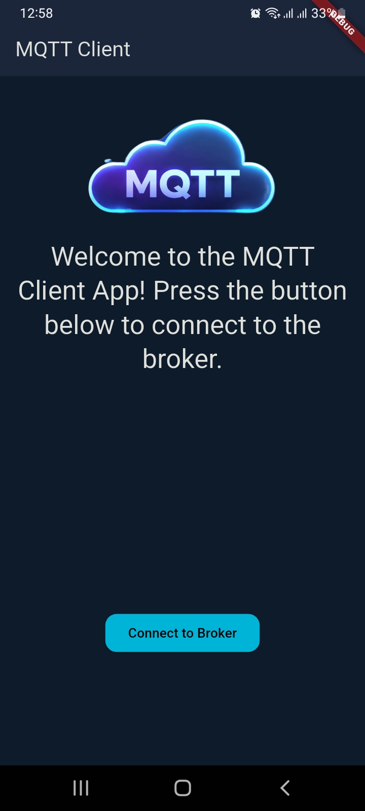 &nbsp;
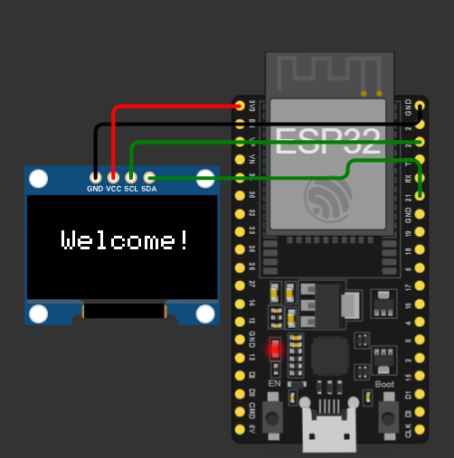 &nbsp;

---

#### When the user press the connect button, the app will connect to the MQTT broker and navigate to the next page where the user can choose to send text or image.

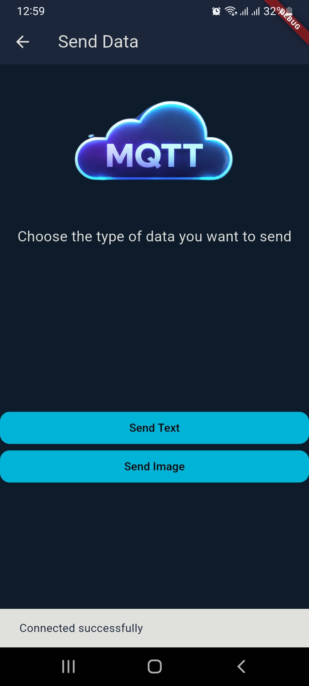 &nbsp;

---

#### If the user choose to send text, they can type a message and send it to the ESP32, which will display it on the OLED screen.

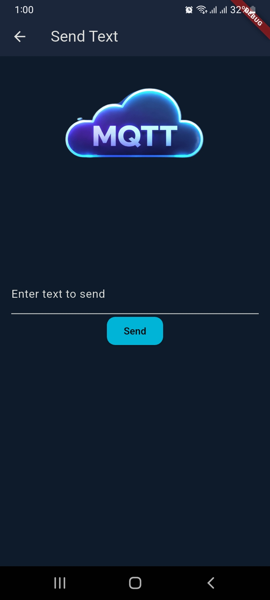 &nbsp;
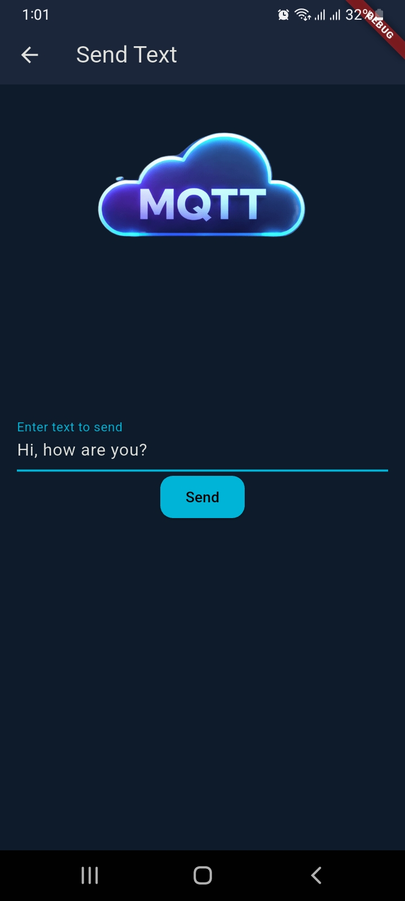 &nbsp;

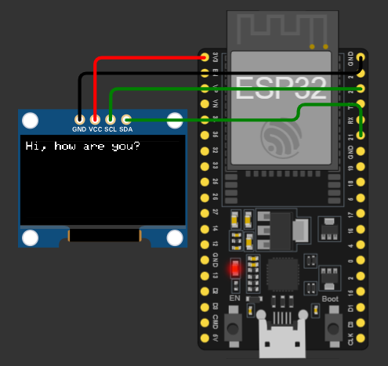 &nbsp;

---

#### If the user choose to send image, they can choose to send a built-in image or pick an image from the gallery.

 &nbsp;
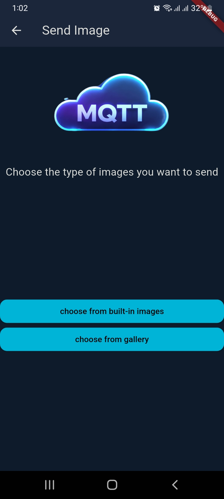 &nbsp;

---

#### If the user choose to send a built-in image, they can select one of the images from the list and send it to the ESP32, which will display it on the OLED screen.

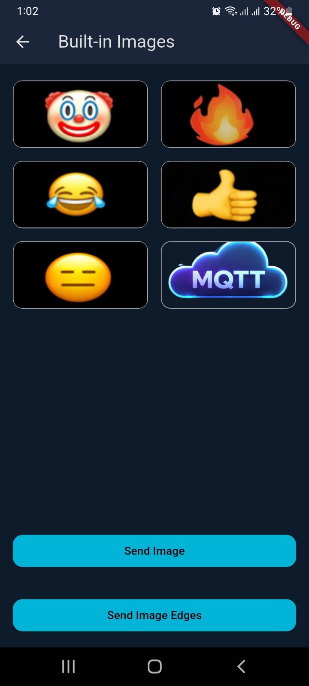 &nbsp;
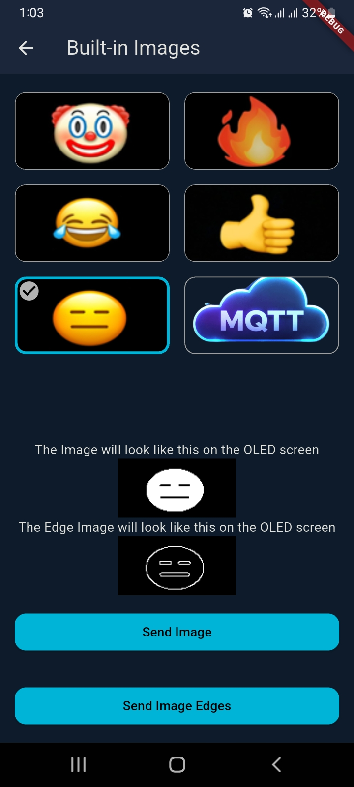 &nbsp;
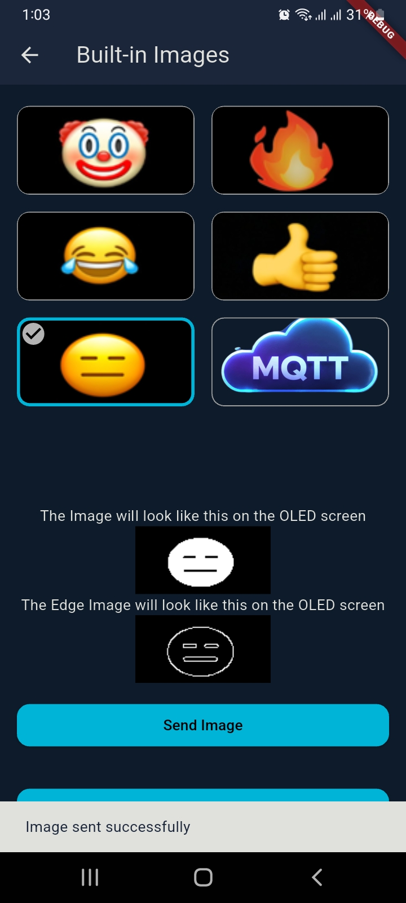 &nbsp;
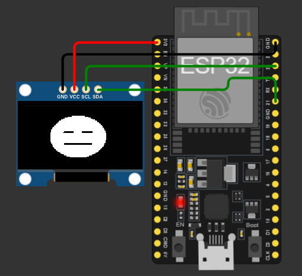 &nbsp;

---

#### If the user press the send edges button, the app will apply the Canny edge detection algorithm to the image and send the edges to the ESP32, which will display it on the OLED screen.

 &nbsp;
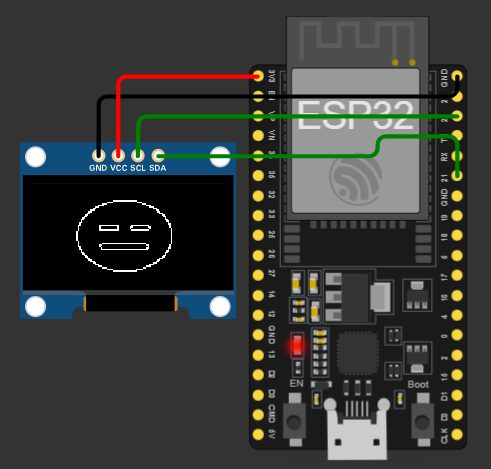 &nbsp;

---

#### if the user choose to pick an image from the gallery, they can select the image from their device.

 &nbsp;
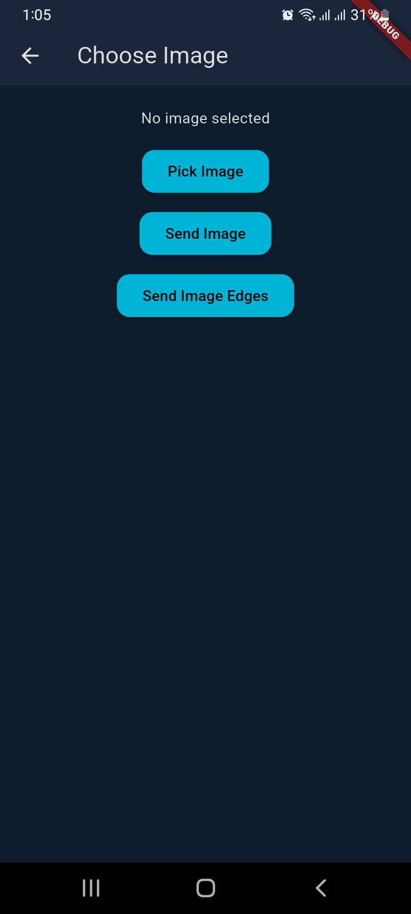 &nbsp;
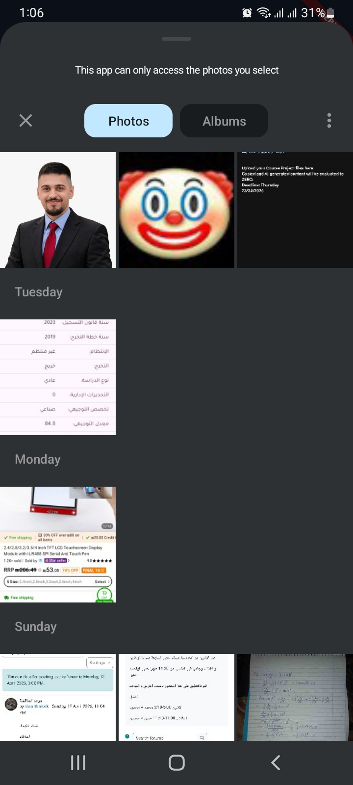 &nbsp;
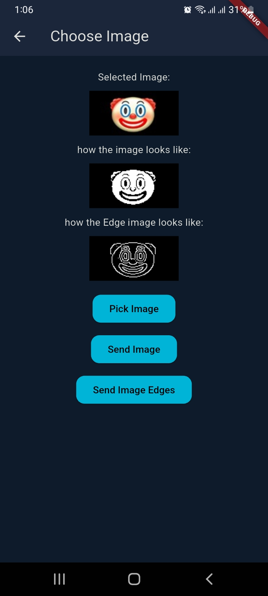 &nbsp;
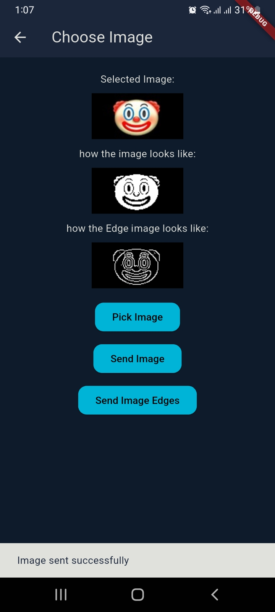 &nbsp;
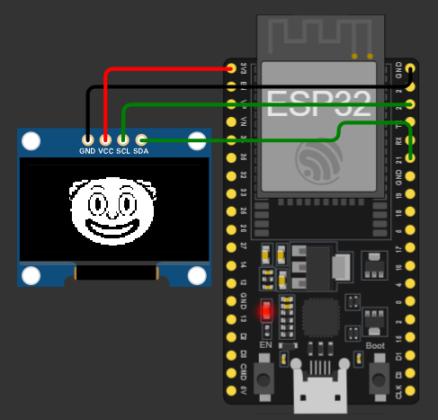 &nbsp;

---

#### if the user press the send edges button, the app will apply the Canny edge detection algorithm to the image and send the edges

 &nbsp;
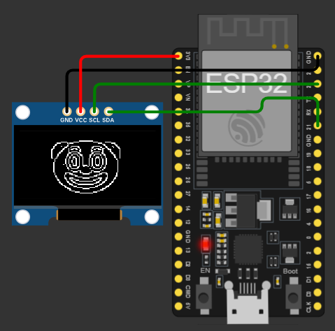 &nbsp;

---

#### if the user selected a large image, the app will resize it but it will not maintain the aspect ratio, so the image will be stretched to fit the OLED screen.

 &nbsp;
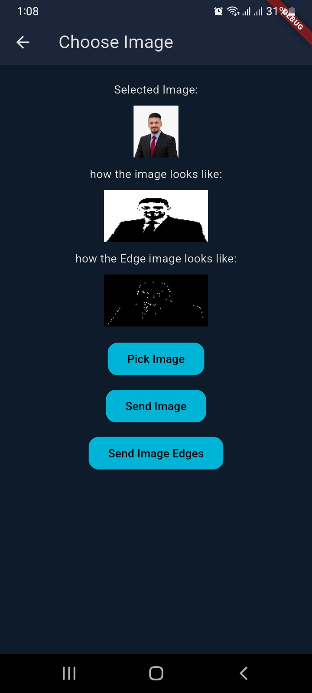 &nbsp;
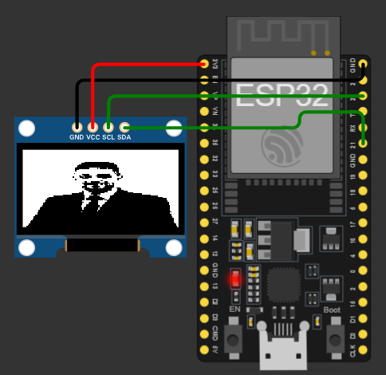 &nbsp;

---

## Setup Instructions

### 1️⃣ Clone the Repository

```bash
git clone https://github.com/your-username/Image-Transfer-using-MQTT
cd Image-Transfer-using-MQTT
```

### 2️⃣ Install Dependencies

```bash
flutter pub get
```

### 3️⃣ Configure MQTT Broker

Open:

```
lib/core/mqtt/mqtt_service.dart
```

Update credentials:

```dart
await client.connect('YOUR_USERNAME', 'YOUR_PASSWORD');
```

Update broker:

```dart
MqttServerClient.withPort('YOUR_BROKER_URL', 'client_id', 8883);
```

### 4️⃣ Run the App

```bash
flutter run
```

---

## Usage

1. Open the app
2. Tap **Connect to Broker**
3. Choose:
   - Send Text
   - Send Image
4. Select image or type message
5. Tap **Send**

---

## Contributing

Contributions are welcome!
Feel free to fork this repo and submit a pull request.


## Author

Developed by **Mohammad AL-Zaroo**\
Computer Engineer 
